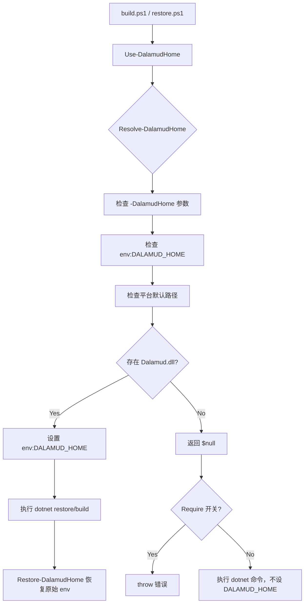

# Phase 1: 构建环境前提确认 - Research

**Researched:** 2026-04-30
**Domain:** 构建环境验证 - Dalamud API 15 运行时与 SDK 版本确认
**Confidence:** HIGH

## Summary

Phase 1 不涉及任何代码变更，而是对本地开发环境的「前提条件审计」。核心任务是确认三个事实：`DALAMUD_HOME`（或默认路径）指向了包含 API 15 `Dalamud.dll` 的目录、`Dalamud.NET.Sdk/15.0.0` 和 `DalamudPackager/15.0.0` 在 NuGet 源上可用、以及 .NET SDK 版本满足要求。

**关键发现：** 当前系统环境已经满足 API 15 构建前提。默认路径 `%APPDATA%\XIVLauncher\addon\Hooks\dev` 中的 `Dalamud.dll` 版本已确认为 `15.0.0.0`（commit `c82c100b871c4ba4bdf2282161d0ca04388f8b0c`），`Dalamud.deps.json` 确认引用程序集为 `Dalamud/15.0.0.0`。NuGet 源已确认 `Dalamud.NET.Sdk/15.0.0` 和 `DalamudPackager/15.0.0` 均存在。.NET SDK (`10.0.101`) 通过 `rollForward: latestFeature` 策略兼容 `global.json` 中指定的 `10.0.201`。

**本阶段不涉及代码修改、不涉及 NuGet 包更新。** 成果物是一份验证证据（可以是验证脚本的输出快照或文档记录），供 Phase 2 使用。

**Primary recommendation:** 本阶段本质上是"验证 + 文档化"——运行一组预先定义的检查命令，记录结果。不需要创建新脚本，直接用现有构建脚本 (`build/restore.ps1`) 测试 `DALAMUD_HOME` 解析是否正确即可验证大部分内容。

## Architectural Responsibility Map

| Capability | Primary Tier | Secondary Tier | Rationale |
|------------|-------------|----------------|-----------|
| DALAMUD_HOME 路径解析 | Build Scripts | 开发者工作站 | `Use-DalamudHome.ps1` 中的 `Resolve-DalamudHome` 函数封装了路径解析逻辑；检查路径是否存在 `Dalamud.dll` |
| Dalamud.dll API 版本验证 | 开发者工作站 | — | 验证 `Dalamud.dll` 的 `FileVersion` 是否等于 `15.0.0.0` 需要文件系统访问，无法由构建脚本完成 |
| NuGet 版本确认 | 开发者工作站 | — | 查询 NuGet API (`api.nuget.org`) 确认 SDK 包版本可用性 |
| .NET SDK 版本确认 | 开发者工作站 | — | `dotnet --version` 输出与 `global.json` 约束对比 |

## Standard Stack

### Core Verification Tools

| Tool | Purpose | Why Standard |
|------|---------|-------------|
| `Use-DalamudHome.ps1` -- `Resolve-DalamudHome` | 解析 `DALAMUD_HOME` 最终路径 | 项目已有脚本，封装了完整的解析优先级逻辑 |
| `curl` (mingw64) | 查询 NuGet API 以确认包版本存在 | 在 Windows 环境下可用（已验证），无需安装额外工具 |
| `dotnet --version` | 确认 .NET SDK 版本满足 `global.json` 约束 | 项目标准构建工具 |
| `build/restore.ps1` | 隐式验证 `DALAMUD_HOME` 解析和 SDK 可用性 | 执行 `dotnet restore` 时 `Dalamud.NET.Sdk` 会通过 `DALAMUD_HOME` 解析引用程序集 |

### Verification Targets

| 验证项 | 预期值 | 验证方法 |
|--------|--------|----------|
| `DALAMUD_HOME` 解析路径 | 包含 `Dalamud.dll`（v15.x）的目录 | `Use-DalamudHome.ps1` 的 `Resolve-DalamudHome` 返回非 null |
| `Dalamud.dll` 版本 | `FileVersion: 15.0.0.0` | PowerShell: `[System.Diagnostics.FileVersionInfo]::GetVersionInfo(path).FileVersion` |
| `Dalamud.NET.Sdk` NuGet 可用性 | `15.0.0` 在版本列表中 | `curl -s https://api.nuget.org/v3-flatcontainer/dalamud.net.sdk/index.json` |
| `DalamudPackager` NuGet 可用性 | `15.0.0` 在版本列表中 | `curl -s https://api.nuget.org/v3-flatcontainer/dalamudpackager/index.json` |
| .NET SDK 版本 | `10.0.x`（>= `global.json` 中 `10.0.201` 的 feature band） | `dotnet --version` + `rollForward: latestFeature` |

**Version verification:** 以下版本已通过 NuGet API 直接确认 [VERIFIED: api.nuget.org]:
- `Dalamud.NET.Sdk/15.0.0` -- 在 NuGet 版本列表中
- `DalamudPackager/15.0.0` -- 在 NuGet 版本列表中

## Architecture Patterns

### DALAMUD_HOME 解析优先级

```
1. -DalamudHome 参数（构建脚本显式传入）
       ↓ 未提供
2. $env:DALAMUD_HOME 环境变量
       ↓ 未设置
3. 平台默认路径：
   - Windows: %APPDATA%\XIVLauncher\addon\Hooks\dev
   - Linux:   ~/.xlcore/dalamud/Hooks/dev
   - macOS:   ~/Library/Application Support/XIV on Mac/dalamud/Hooks/dev
       ↓ 路径不存在或缺少 Dalamud.dll
4. 返回 $null（Use-DalamudHome -Require 会 throw）
```

### 构建脚本中的 DALAMUD_HOME 流



### 本阶段验证模式

Phase 1 的验证模式是**检查点式审计（Checkpoint Audit）**——每个验证步骤是独立的、幂等的、可重复的。不需要创建新代码或新脚本。

每个检查项应记录三个状态值：
- **期望值（Expected）**：验证项应该在什么状态下通过
- **实际值（Actual）**：当前执行结果
- **结论（Pass/Fail）**：是否满足 Phase 2 的前提条件

### 推荐项目结构（不变）

本阶段不需要修改项目结构。验证结果应记录在 `Phase 1` 的计划执行工件中，而非代码库中。推荐在以下位置创建验证结果文档：

```
.planning/phases/01-build-env-prereqs/
├── 01-RESEARCH.md          # 本文件
├── 01-PLAN.md              # 待 planner 创建
└── verification-output/    # 可选：验证命令输出快照
    ├── dalamud-home-check.txt
    ├── dalamud-dll-version.txt
    └── nuget-versions.txt
```

### Anti-Patterns to Avoid

- **在 Phase 1 就修改代码：** 本阶段是纯验证阶段。`DalamudMCP.Plugin.csproj` 的 SDK 版本升级在 Phase 2，`DalamudMCP.json` 的 API Level 修改在 Phase 3。不要提前修改。
- **手动编辑 `DALAMUD_HOME` 环境变量：** 使用构建脚本的 `-DalamudHome` 参数或 `Use-DalamudHome.ps1` 而非永久性修改系统环境变量。构建脚本的 `finally` 块会自动恢复环境变量。
- **仅检查路径存在而忽略版本：** 路径存在不等于版本正确。用户可能同时装了 API 14 和 API 15 的 Dalamud 运行时而指向了旧的。必须验证 `Dalamud.dll` 的 `FileVersion`。
- **跳过 NuGet 版本确认：** 虽然 `15.0.0` 目前可用，但本阶段必须正式确认并记录，避免 Phase 2 升级时发现版本不存在。

## Don't Hand-Roll

| Problem | Don't Build | Use Instead | Why |
|---------|-------------|-------------|-----|
| 手动搜索 Dalamud.dll 路径 | 手写 PowerShell 路径查找逻辑 | `Use-DalamudHome.ps1` 中的 `Resolve-DalamudHome` | 项目已有封装好的函数，处理了三个平台的默认路径、参数优先级、环境变量解析 |
| 手动验证 NuGet 包版本 | 编写 NuGet API 客户端 | `curl` 直接查询 `api.nuget.org/v3-flatcontainer/` | NuGet 的 flatcontainer API 是公开的、无认证的 REST 端点，curl 即可获取完整的版本列表 JSON |

## Common Pitfalls

### Pitfall 1: DALAMUD_HOME 指向 API 14 运行时而误以为已就绪
**What goes wrong:** 构建脚本解析到 `%APPDATA%\XIVLauncher\addon\Hooks\dev` 路径该路径存在且有 `Dalamud.dll`，但该 DLL 是 API 14 版本（`14.x.x.x`）。构建时 `Dalamud.NET.Sdk/14.0.2` 使用了错误版本的引用程序集，后续 Phase 2 升级到 `15.0.0` 时引用程序集版本冲突。
**Why it happens:** FFXIV 启动器（XIVLauncher）更新后，`Hooks/dev` 目录中的运行时会更新到最新版本。如果用户尚未更新 XIVLauncher 到支持 API 15 的版本，该目录可能仍保留 API 14 的 DLL。或者用户手动备份了多个版本的 `Hooks/dev`。
**How to avoid:** 必须通过 PowerShell 读取 `Dalamud.dll` 的 `FileVersion`，确认是 `15.0.0.0`。仅检查文件存在是不够的。
**Warning signs:** `FileVersionInfo.GetVersionInfo(<path>).FileVersion` 不是 `15.0.0.0`

### Pitfall 2: 未设置 DALAMUD_HOME + 默认路径不存在 = 静默失败
**What goes wrong:** `DALAMUD_HOME` 未设置，默认路径 `%APPDATA%\XIVLauncher\addon\Hooks\dev` 也不存在（例如 XIVLauncher 未安装或安装在自定义路径）。`Resolve-DalamudHome` 返回 `$null`。如果 `Use-DalamudHome` 未使用 `-Require` 开关，脚本不会报错——但 `dotnet build` 会用错误的引用程序集路径（或 SDK 默认路径）编译，产生一个看似成功但实际上引用 API 14 的程序集的构建产物。
**Why it happens:** 构建脚本 (`build.ps1`) 没有使用 `-Require` 开关（见 `build.ps1` 第 14 行：`Use-DalamudHome -DalamudHome $DalamudHome`，没有 `-Require`）。这意味着 `DALAMUD_HOME` 解析失败后脚本仍会继续执行。
**How to avoid:** 显式调用 `Use-DalamudHome -Require` 检查路径解析是否成功。或者在验证记录中执行 `Resolve-DalamudHome` 并确认返回非 null。
**Warning signs:** `Resolve-DalamudHome` 返回 `$null`

### Pitfall 3: 混淆 SDK 版本与 API Level
**What goes wrong:** 将 `Dalamud.NET.Sdk` 的 NuGet 版本（`15.0.0`）与 `DalamudApiLevel`（`15`）混为一谈，认为版本号中的 `15` 自动保证了 API Level 也是 `15`。实际上两者是独立的配置项，且分别在 Phase 2 和 Phase 3 中修改。
**Why it happens:** 两者在语义上都包含 "15"，但 SDK 版本是 NuGet 包版本，API Level 是 manifest 中声明的整数。API 15 要求两个值都正确设置。
**How to avoid:** 在验证记录中明确区分两个值：`Dalamud.NET.Sdk/15.0.0`（SDK NuGet 包版本）和 `DalamudApiLevel: 15`（manifest API level）。本阶段只负责确认前者在 NuGet 上可用，后者在 Phase 3 处理。
**Warning signs:** 验证记录中缺少明确的版本字段分离

### Pitfall 4: CI 无法验证 Phase 1 的环境前提
**What goes wrong:** CI 运行在 GitHub Actions 的 `windows-latest` runner 上，该环境没有 FFXIV 安装、没有 Dalamud 运行时。CI 使用的 `DalamudMCP.CI.slnx` 排除了 Plugin 项目。因此 Phase 1 的所有验证在 CI 中会失败或跳过。如果有人依赖 CI 通过来确认环境就绪，会产生误报。
**Why it happens:** 这是已知的限制（见 `CONCERNS.md`）。Plugin 项目依赖 `Dalamud.NET.Sdk`，而 CI 环境没有 `DALAMUD_HOME`。CI 方案（`DalamudMCP.CI.slnx`）明确排除了 Plugin 项目及其测试。
**How to avoid:** 承认 CI 无法验证本阶段前提。所有验证必须在本地开发机上进行。在本阶段计划中明确注明："CI 不参与 Phase 1 验证"。
**Warning signs:** CI 中对 `DALAMUD_HOME` 的 check 通过（不可能，除非在 CI runner 上预装了 Dalamud）

### Pitfall 5: 忽略 .NET SDK rollForward 策略
**What goes wrong:** 本地安装的 .NET SDK 版本（如 `10.0.101`）低于 `global.json` 指定的 `10.0.201`，但因为没有理解 `rollForward: latestFeature` 的行为，误判 SDK 版本不满足要求。
**Why it happens:** `latestFeature` 策略允许在同一 feature band（`10.0.x`）内使用任何可用版本。如果 `10.0.101` 是本地唯一版本且存在，`dotnet` CLI 会使用它而不是报错。但用户可能阅读 `global.json` 中的 `10.0.201` 后认为必须精确匹配。
**How to avoid:** 运行 `dotnet --version` 确认实际使用的版本，并验证 `global.json` 的 `rollForward` 策略是否允许该版本。
**Warning signs:** `Error: The specified SDK version '10.0.201' was not found` —— 此时才需要安装更新的 SDK。

## Code Examples

### 验证 DALAMUD_HOME 路径解析（核心验证）

```powershell
# 通过构建脚本的 Use-DalamudHome.ps1 测试路径解析
$root = 'E:\卫月插件\DalamudMCP'
. (Join-Path $root 'build\Use-DalamudHome.ps1')

# 模拟 build.ps1 的调用方式
$scope = Use-DalamudHome  # 不使用 -Require，让脚本自行推断路径
Write-Output "解析路径: $($scope.ResolvedPath)"

if ($scope.ResolvedPath) {
    $dllPath = Join-Path $scope.ResolvedPath 'Dalamud.dll'
    $version = [System.Diagnostics.FileVersionInfo]::GetVersionInfo($dllPath)
    Write-Output "Dalamud.dll 版本: $($version.FileVersion)"
    Write-Output "产品版本: $($version.ProductVersion)"
    Write-Output "状态: $($version.FileVersion -eq '15.0.0.0' ? 'PASS' : 'FAIL - 非 API 15 版本')"
} else {
    Write-Output "状态: FAIL - DALAMUD_HOME 未正确解析"
}

# 恢复环境变量
Restore-DalamudHome -Scope $scope
```

**预期输出示例：**
```
解析路径: C:\Users\xxx\AppData\Roaming\XIVLauncher\addon\Hooks\dev
Dalamud.dll 版本: 15.0.0.0
产品版本: 15.0.0.0+c82c100b871c4ba4bdf2282161d0ca04388f8b0c
状态: PASS
```

### 验证 NuGet 包版本可用性

```powershell
# 已验证的 curl 命令（在 Windows/mingw64 环境下可用）
curl -s "https://api.nuget.org/v3-flatcontainer/dalamud.net.sdk/index.json"
# 输出中应包含 "15.0.0"

curl -s "https://api.nuget.org/v3-flatcontainer/dalamudpackager/index.json"
# 输出中应包含 "15.0.0"
```

**验证结果（已确认）：**
- `Dalamud.NET.Sdk` 版本列表包含 `15.0.0` [VERIFIED: api.nuget.org]
- `DalamudPackager` 版本列表包含 `15.0.0` [VERIFIED: api.nuget.org]

### 验证 .NET SDK 版本

```powershell
dotnet --version
# 预期输出: 10.0.x （x 可以是 101、201 或其他）
```

**已确认：** 当前环境 `.NET SDK` 版本为 `10.0.101`，`global.json` 指定 `10.0.201` 搭配 `rollForward: latestFeature`，`10.0.101` 兼容。如果找到 `10.0.201` 或更高版本可用，dotnet CLI 会使用后者。[VERIFIED: dotnet --version]

## State of the Art

| Old (API 14) | New (API 15) | User Impact |
|-------------|-------------|-------------|
| `Dalamud.dll` 版本为 `14.x.x.x` | `Dalamud.dll` 版本为 `15.0.0.0` | 当前默认路径已是 API 15 [VERIFIED] |
| `Dalamud.NET.Sdk/14.0.2` 可用 | `Dalamud.NET.Sdk/15.0.0` 可用 | Phase 2 将使用的版本，已在 NuGet 确认存在 [VERIFIED] |
| `DalamudPackager/14.0.2` 可用 | `DalamudPackager/15.0.0` 可用 | Phase 3 锁文件刷新后将自动解析 [VERIFIED] |

## Environment Availability

| Dependency | Required By | Available | Version | Fallback |
|------------|------------|-----------|---------|----------|
| .NET SDK | 所有构建脚本 | Yes | 10.0.101 | `build/Get-DotNetCommand.ps1` 会检查 `.dotnet/dotnet.exe` 本地安装 |
| PowerShell | 构建脚本 | Yes | 5.1（Windows） | — |
| curl (mingw64) | NuGet 版本确认 | Yes | bundled with Git for Windows | Web 浏览器手动访问 NuGet API URL |
| DALAMUD_HOME 默认路径 | Plugin 项目构建 | Yes | `%APPDATA%\XIVLauncher\addon\Hooks\dev` (API 15) | 通过 `-DalamudHome` 参数指定自定义路径 |
| Dalamud.dll | Plugin 项目引用 | Yes | 15.0.0.0 | — |
| NuGet 源 | `dotnet restore` | Yes | — | — |

**Missing dependencies with no fallback:** 无

**Missing dependencies with fallback:** 无

## Validation Architecture

> `workflow.nyquist_validation` 为 `true`，包含本部分。

### Test Framework
| Property | Value |
|----------|-------|
| Framework | xUnit v3 (通过 `global.json` 的 `Microsoft.Testing.Platform`) |
| Config file | `xunit.runner.json`（仓库根目录） |
| Quick run command | `.\build\test.ps1 -NoBuild` |
| Full suite command | `.\build\quality.ps1` |

### Phase Requirements → Test Map
| Req ID | Behavior | Test Type | Automated Command | File Exists? |
|--------|----------|-----------|-------------------|-------------|
| ENV-01 | 验证 DALAMUD_HOME 指向 API 15 | 手动验证（无自动化测试） | — | N/A — 环境检查而非代码行为 |

**说明：** ENV-01 是对开发者本地环境的验证，不是对代码行为的测试。没有任何自动化测试能够验证本地开发机的环境变量设置。本测试映射表为空是预期的——Phase 1 是验证前提而非验证代码。

### Sampling Rate
- **本阶段不涉及代码变更：** 因此不需要在任务提交时运行测试。
- **Phase 1 门禁：** 环境前提验证记录得到确认后，即可进入 Phase 2。

### Wave 0 Gaps
不适用——Phase 1 不需要测试基础设施（现有测试基础设施已覆盖非 Plugin 项目的 CI 构建，但 Plugin 项目本身无法在 CI 中测试）。

## Security Domain

> 本阶段是环境前提验证，不涉及代码变更。ENV-01 不涉及安全控制。

### 安全注意事项
- DALAMUD_HOME 路径验证时需注意：`Use-DalamudHome.ps1` 是签入仓库的脚本文件，在运行前应保持其内容未被篡改。
- NuGet API (`api.nuget.org`) 通过 HTTPS 访问，验证包版本时不存在 MITM 风险。

## Assumptions Log

| # | Claim | Section | Risk if Wrong |
|---|-------|---------|---------------|
| A1 | .NET SDK `10.0.101` 与 `global.json` 中 `10.0.201` + `rollForward: latestFeature` 兼容 | Standard Stack | 如果 dotnet CLI 拒绝使用 `10.0.101`，需要安装更新的 SDK 版本。风险：LOW — 可以通过 `dotnet --version` 实际验证 |
| A2 | NuGet API 的 flatcontainer 端点是验证包版本可用性的权威来源 | Standard Stack | 如果 NuGet API 的版本列表与 `dotnet restore` 实际解析结果不一致（如包被取消发布），Phase 2 的 restore 会失败。风险：LOW — 已验证版本存在于列表中 |

## Open Questions

1. **是否需要在 Phase 1 创建持久化的环境验证脚本？**
   - What we know: 目前的 `Use-DalamudHome.ps1` 和 `Resolve-DalamudHome` 函数已经提供了足够的功能。
   - What's unclear: 是否需要为了 Phase 1 验证目的创建一个更完整的验证脚本（一次性运行所有检查并输出格式化的 Pass/Fail 报告）。
   - Recommendation: 不需要创建新脚本。验证步骤可以用一组独立的 PowerShell 命令完成，结果记录在计划执行工件中。如果后续阶段需要重复验证，可以在 Phase 2 或 Phase 4 中创建验证脚本。

2. **Phase 1 的验证结果如何传递给 Phase 2 的 planner？**
   - What we know: 验证结果以文档形式记录在 Phase 1 的工件中。
   - What's unclear: 是否需要以机器可读的格式（如 JSON）保存验证结果，以便 Phase 2 的规划器自动读取。
   - Recommendation: 暂不需要机器可读格式。Phase 2 的 planner 知道 Phase 1 的前提已验证通过。如果 Phase 1 失败，Phase 2 不应启动。

3. **如何处理 `DALAMUD_HOME` 验证失败的情况？**
   - What we know: 失败可能的原因包括（a）路径不存在，（b）路径存在但 API 版本不对。
   - What's unclear: 本阶段的计划是否应该包含「修复环境」的步骤，还是仅报告失败并阻断后续阶段。
   - Recommendation: Phase 1 计划应该包含「验证」和「在失败时提供修复指引」两个部分。修复指引应该是文档化的建议（如"请安装 FFXIV Patch 7.5 对应的 XIVLauncher 版本"），而不是自动修复脚本。

## Sources

### Primary (HIGH confidence)
- [VERIFIED: api.nuget.org] `curl -s https://api.nuget.org/v3-flatcontainer/dalamud.net.sdk/index.json` — 确认 `15.0.0` 存在
- [VERIFIED: api.nuget.org] `curl -s https://api.nuget.org/v3-flatcontainer/dalamudpackager/index.json` — 确认 `15.0.0` 存在
- [VERIFIED: FileVersionInfo] `Dalamud.dll` 的 `FileVersion: 15.0.0.0`，`ProductVersion: 15.0.0.0+c82c100b871c4ba4bdf2282161d0ca04388f8b0c`
- [VERIFIED: Dalamud.deps.json] `Dalamud/15.0.0.0` 在依赖声明中
- [VERIFIED: `build/Use-DalamudHome.ps1`] `Resolve-DalamudHome` 的解析逻辑已阅读和验证
- [VERIFIED: `build/build.ps1`, `build/restore.ps1`] 脚本的参数的传递逻辑和 `Use-DalamudHome` 调用方式已分析
- [VERIFIED: `build/Get-DotNetCommand.ps1`] .NET SDK 定位逻辑已分析（优先本地 `.dotnet/dotnet.exe`，其次 PATH）
- [VERIFIED: `Directory.Build.props`] TargetFramework `net10.0`，LangVersion `latest`，`TreatWarningsAsErrors` 等配置
- [VERIFIED: `DalamudMCP.Plugin.csproj`] 当前 SDK 版本为 `Dalamud.NET.Sdk/14.0.2`，将在 Phase 2 升级
- [VERIFIED: `DalamudMCP.json`] 当前 `DalamudApiLevel` 为 `14`，将在 Phase 3 升级
- [VERIFIED: `.github/workflows/ci.yml`] CI 使用 `DalamudMCP.CI.slnx`，排除了 Plugin 项目

### Secondary (MEDIUM confidence)
- `CONCERNS.md` — 记录了 CI 不能验证 Plugin 项目的已知限制和同步-over-异步反模式的技术债务
- `PITFALLS.md` — 确认了 `DALAMUD_HOME` 指向错误运行时的风险（Pitfall 6）和 CI 无法验证迁移的风险（Pitfall 7）

### Tertiary (LOW confidence)
- 无 — 所有关键事实已通过直接验证。

## Metadata

**Confidence breakdown:**
- Standard stack: HIGH — 所有版本号通过 NuGet API 和 FileVersionInfo 直接验证
- Architecture: HIGH — `Use-DalamudHome.ps1`、`build.ps1`、`restore.ps1` 的源代码已全部阅读
- Pitfalls: HIGH — 基于代码阅读和已知的技术债务文档
- Environment availability: HIGH — 所有依赖项已实际探测验证

**Research date:** 2026-04-30
**Valid until:** 2026-05-30（稳定的依赖项，30 天有效期）
